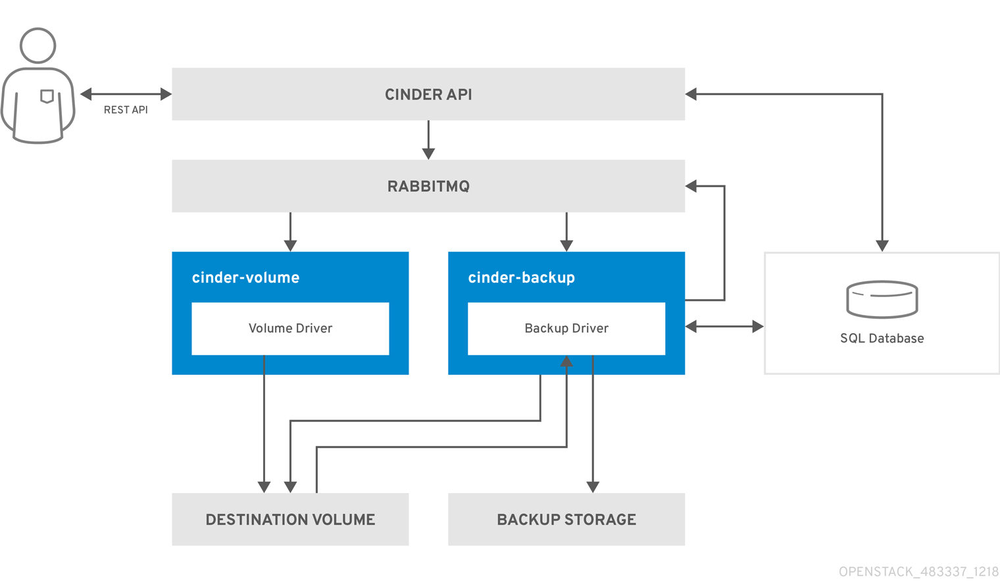

# Volume-backup-workflow

1. The user issues a request to the `cinder API`, which is a REST API, to back up a Block Storage volume.

2. The `cinder API` receives the request and validates the request, the user credentials, and other information.

3. The `cinder API` creates the backup record in the _*SQL database*_.

4. The `cinder API` makes an asynchronous _*RPC call*_ to the `cinder-backup` service via AMQP to back up the volume.

5. The `cinder API` returns the current backup record, with an ID, to the API caller.

6. An RPC create message arrives on one of the backup services.

7. The `cinder-backup` service performs a synchronous RPC call to get_backup_device.

8. The `cinder-volume` service ensures that the correct device is returned to the caller. Normally, it is the same volume, but if the volume is in use, the service returns a temporary cloned volume or a temporary snapshot, depending on the configuration.

9. The `cinder-backup` service issues another synchronous RPC to `cinder-volume` to expose the source device.

10. The `cinder-volume` service exports and maps the source device (volume or snapshot) and returns the appropriate connection information.

11. The `cinder-backup` service attaches the source device by using the connection information.

12. The `cinder-backup` service calls the backup backend end driver, with the device already attached, which begins the data transfer to the backup repository.

13. The source device is detached from the Backup host.

14. The `cinder-backup` service issues a synchronous RPC to `cinder-volume` to disconnect the source device.

15. The `cinder-volume` service unmaps and removes the export for the device.

16. If a temporary volume or temporary snapshot was created, `cinder-backup` calls `cinder-volume` to remove it.

17. The `cinder-volume` service removes the temporary volume.

18. When the backup is completed, the backup record is updated in the database.
